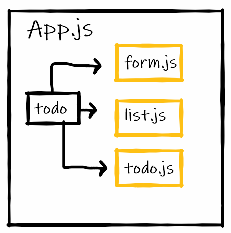

# todo

## Deploy links:
- [Netlify](https://todo-007.netlify.app/)
- [heroku](https://todo-007.herokuapp.com/)

## Pull Request Link
[PulReq](https://github.com/Fatensamman/todo/pull/1)

## UML Image:

Setup:
Clone the repository.
install the react js library and bootstrap for react.
